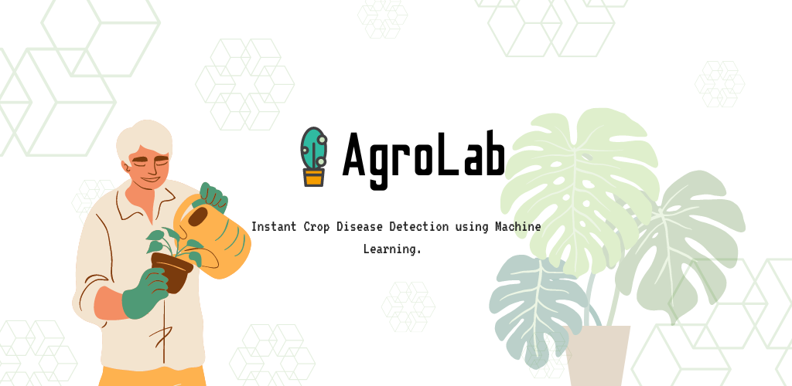
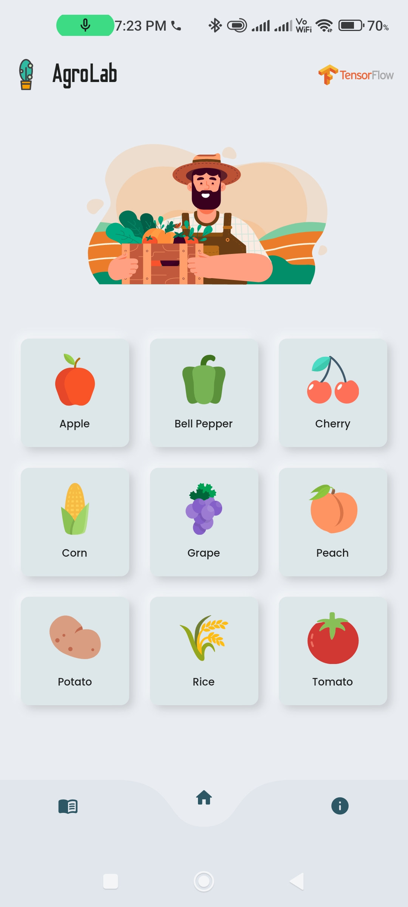
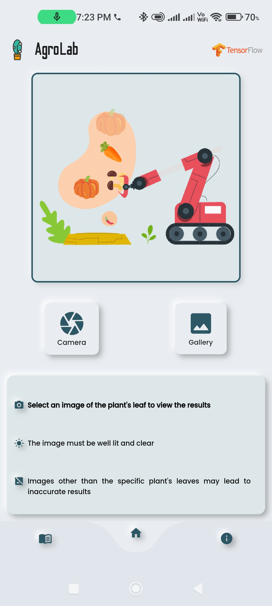
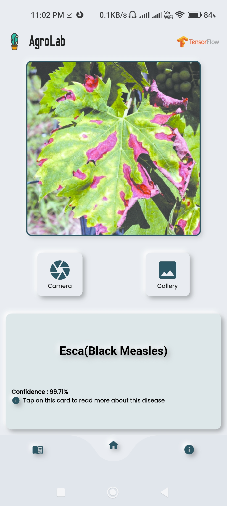
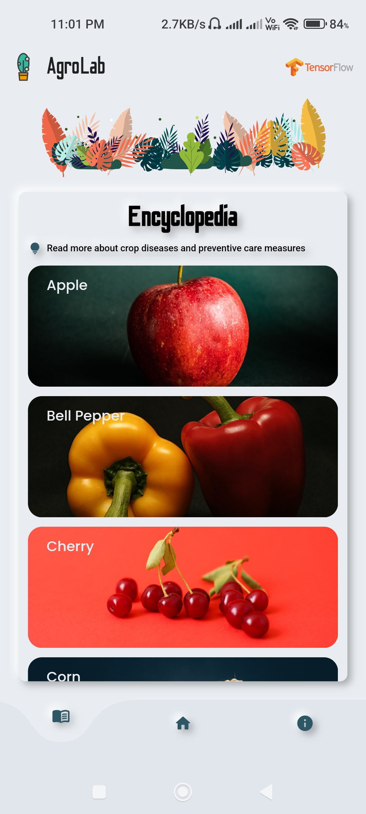

# AgroLab

An Android app for plant disease detection using Machine Learning, with a clean and minimal user interface.

## Tech Stack

  

## Screenshots

## Features

- Supports a variety of crops
- Clean and intuitive user interface
- Individual trained machine learning models for each crop for improved accuracy
- Super-quick scan results 
- Want to learn more about plant diseases and care? The Encyclopedia section in the app does just that!

## Team

